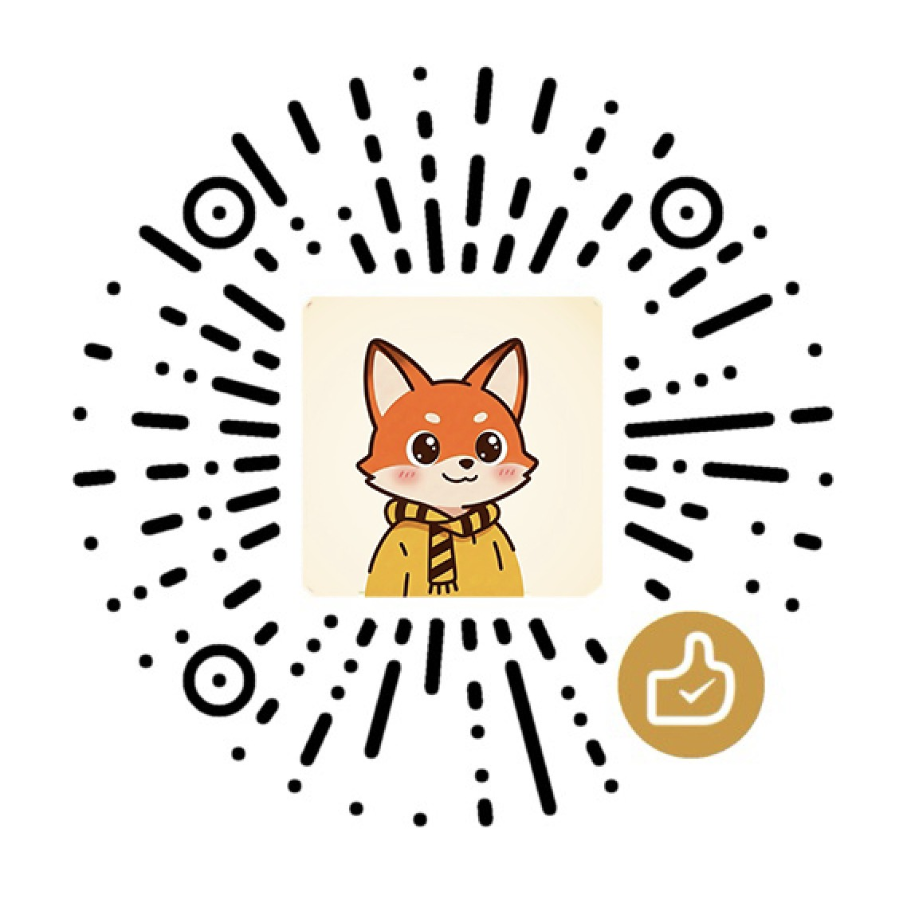

# AI 产品从入门到精通

> 一套面向 AI 产品经理的完整培训课程，涵盖大模型底层原理到 AI 工程化落地。

🌐 **在线访问：** <https://xueai.app>

***

## 课程介绍

七大篇章 + 一道课后甜点，54 个主题、180+ 页交互式幻灯片，全部免费开放：

### 第一篇章 · 大模型是怎么来的

* Token 生成机制与训练原理

* GPT 跃进历程

* 从补全到对话的演变

* 大模型幻觉的成因与四种缓解方案（RAG、Prompt、SFT、Temperature）

### 第二篇章 · AI Harness

* 上下文工程

* Prompt 进阶与 Prompt 注入防御

* Agent 设计与工具调用（ReAct 框架）

* 向量数据库与 Milvus（RAG、Agent 知识库）

* 五层成本优化体系（KV Cache 等）

### 第三篇章 · 实战：从 Demo 到产品

* 生图产品化

* Agent 循环控制与上下文压缩

* 长期记忆设计

* 多 Agent 协作与 MCP 生态

### 第四篇章 · 进阶：AI 工程设计模式

* 基于 Claude Code 源码拆解上下文工程

* 工具设计与评测方法论

* 安全容器化

### 第五篇章 · Harness 与自我改进

* Harness 设计模式

* 上下文工程的自动进化

* 递归自我改进前沿

### 第六篇章 · 解剖 Grok Build

* 沿 Rust 源码拆解生产级 Coding Agent

* 运行时、工具与记忆机制

* 安全与扩展设计

### 第七篇章 · Vibe Coding 方法论

* 基于开源仓库 xs_vibe_rules 的 AI 协作规范

* 流程控制与质量底线

* 文档沉淀、安全闸门与写作风格

### 课后甜点 · 雷军创业课

非 AI 正课的加餐，整理自雷军创业公开课的产品与 OPC 创业方法论：

* 创业七字诀

* 找钱融资、估值与股权

* 现金流管理

***

## 本地阅读

课件都是单文件 HTML，直接双击 `slides/` 下的任意页面用浏览器打开即可，无需服务器。
想从头看，先开 `slides/home.html`（首页）或 `slides/learn.html`（课程目录）。

***

## 关于作者

**洛小山** · AI 产品经理 / 独立开发者

* 🌐 课程网站：<https://xueai.app>

* 🏠 个人网站：<https://luoxiaoshan.cn>

* 📖 公众号：**洛小山**（扫码关注，获取更多 AI 干货）

<table>
<tr>
<td align="center">
 
<b>关注公众号</b> 洛小山
</td>
<td width="40"></td>
<td align="center">
 
<b>请我喝杯咖啡</b> 赞赏支持
</td>
</tr>
</table>

***

## 开源理念与协议

AI 时代，优质的学习资料应该属于每一个想学习的人，而不是少数人的收费壁垒。

这个项目选择开源，是希望让更多人能接触到系统的 AI 知识，共同推动整个行业的学习氛围。我们相信，知识的流动越自由，行业整体的水位就越高——这对所有人都有益。

但开源不代表可以被滥用。**我们唯一不希望看到的，是有人把本该属于大家的学习内容，包装成付费课程、闭源产品，转手牟利。** 这不仅辜负了开源社区的信任，也在侵蚀我们共同努力营造的学习生态。

因此，本项目采用 **AGPL-3.0 协议**：

* ✅ 任何人都可以**免费使用、学习、改进**这份内容

* 🔄 基于本项目的修改或衍生版本，**必须同样开源**，让改进回流社区

* 📌 无论是网站部署还是内容二次传播，**必须保留原作者署名**

* ❌ **禁止将本项目用于闭源商业产品**

***

*Copyright (c) 2026 洛小山 · Miyang Tech (Zhuhai Hengqin) Co., Ltd.*\
*Licensed under* *[GNU AGPL v3.0](LICENSE)*
